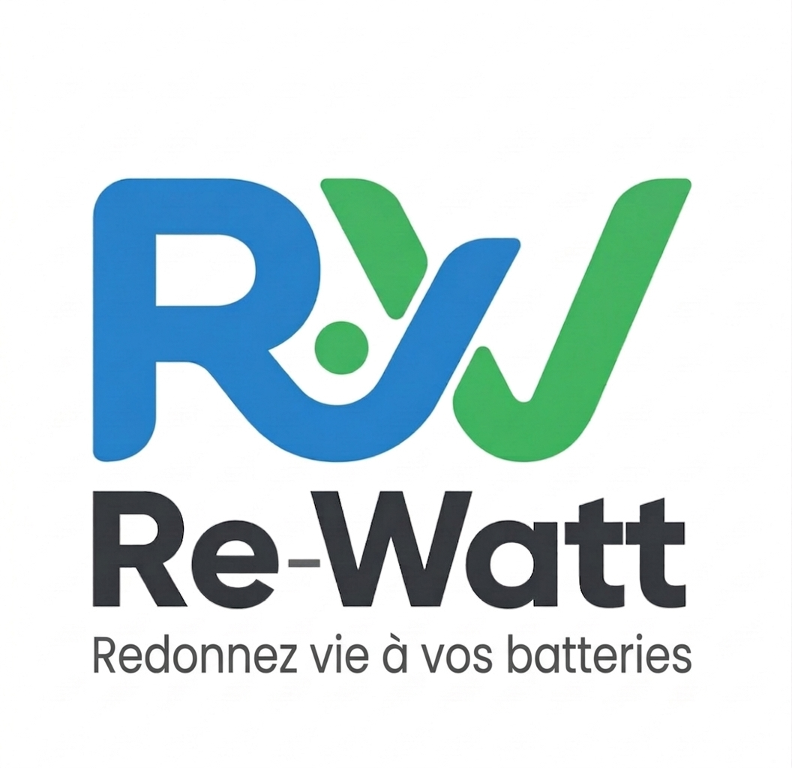

# Re-Watt — Landing page

One-pager statique en HTML/CSS/JS vanilla. Aucun build, aucune dépendance (hors Google Fonts).

## Aperçu local

Ouvrir simplement `index.html` dans un navigateur (double-clic) ou servir le dossier :

```bash
cd re-watt-landing
python3 -m http.server 8000
# puis http://localhost:8000
```

## Personnalisation

Tout ce qui est à modifier est repérable dans `index.html` par un commentaire ou un nom de variable.

### 1. Logo

Chercher le marqueur `LOGO_PLACEHOLDER` dans le `<header>`. Remplacer le bloc :

```html
<div class="logo" aria-label="Logo Re-Watt">
  <!-- LOGO_PLACEHOLDER -->
  <span class="logo-fallback">Re-Watt</span>
</div>
```

par :

```html
<div class="logo" aria-label="Logo Re-Watt">
  
</div>
```

et déposer le fichier `logo.png` (ou `.svg`) à côté de `index.html`.

### 2. Baseline

Chercher `BASELINE_PLACEHOLDER`. Modifier le texte juste en dessous (par défaut « Redonnez vie à vos batteries »).

### 3. Email de contact

Tout en bas du fichier, dans le `<script>` :

```js
const CONTACT_EMAIL = 'contact@re-watt.fr';
```

Cette variable alimente automatiquement les 4 cartes (Particulier / Professionnel / Partenaire / Écosystème) **et** le lien email du footer. Un seul endroit à changer.

### 4. Couleurs et tokens design

Dans la balise `<style>`, bloc `:root` :

```css
--color-primary: #2D7A4F;       /* vert principal */
--color-primary-dark: #225e3c;
--color-accent: #A8D5BA;        /* vert clair (badge, hover…) */
--color-bg: #FAFAF7;            /* fond de page */
--color-text: #1A1A1A;
--color-text-muted: #5C5C5C;
--color-border: #E5E5E5;
```

### 5. Image Open Graph

Pour un bon rendu sur LinkedIn / Twitter / Slack, remplacer le placeholder :

```html
<meta property="og:image" content="og-image.png">
```

par une vraie image **1200 × 630 px** (déposée à côté de `index.html`).

### 6. Favicon

Remplacer la balise `<link rel="icon" href="data:image/svg+xml,…">` par :

```html
<link rel="icon" href="favicon.ico">
```

et déposer un `favicon.ico` à côté de `index.html`.

### 7. Réseaux sociaux (plus tard)

Un commentaire `<!-- TODO : ajouter liens réseaux sociaux ici -->` est placé dans le `<footer>`.

## Déploiement

Le site est 100 % statique : n'importe quel hébergeur fonctionne.

### Netlify (le plus rapide — 30 secondes)

1. Aller sur [app.netlify.com/drop](https://app.netlify.com/drop)
2. Glisser-déposer le dossier `re-watt-landing` complet
3. Netlify donne une URL `*.netlify.app` immédiatement
4. (Optionnel) brancher un nom de domaine custom dans Settings → Domain

### GitHub Pages

```bash
# dans un repo GitHub
git add index.html README.md logo.png
git commit -m "Landing page Re-Watt"
git push
# puis : Settings → Pages → Source = main branch / root
```

### OVH (FTP)

Uploader `index.html` (et le logo, le favicon, l'image OG) à la racine de l'hébergement (ou dans `/www/`).

### Vercel

```bash
npx vercel
```

## Ce qui est inclus

- HTML5 sémantique (`<header>`, `<main>`, `<section>`, `<footer>`)
- Responsive mobile-first (320 px → 1440 px+) — grille 1 / 2 / 4 colonnes
- Accessibilité : skip link, focus visible, contrastes WCAG AA, `prefers-reduced-motion`
- SEO : title, meta description, Open Graph, lang="fr"
- Police Inter via Google Fonts (preconnect)
- 4 CTA mailto avec sujet et corps de message pré-remplis et bien encodés (accents, retours à la ligne)

## Ce qui n'est pas inclus (intentionnellement)

- Pas de tracking, pas d'Analytics, pas de bandeau cookies
- Pas de framework, pas de build step
- Pas de réseaux sociaux (ajout prévu)
